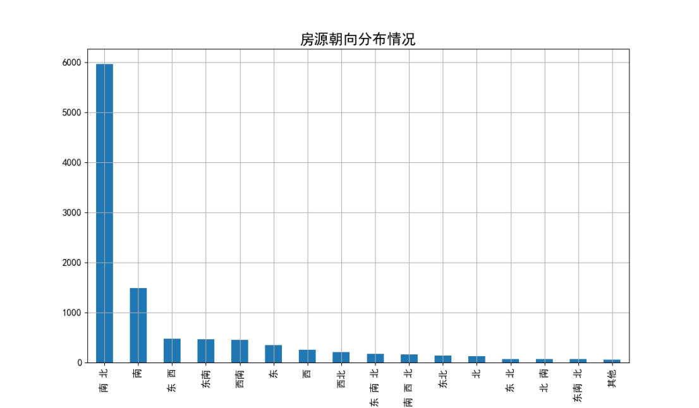

# Beijing-second_hand_house

Data collection and visualization analysis of Second-hand housing in Beijing based on Python

基于Python的北京二手房数据采集及可视化分析

数据采集时间：2019年12月

## 一．项目背景

随着城市化进程的不断前进，互联网技术的飞速发展，以及人们对于便利、舒适的居住需求，致使房屋交易日趋活跃。房地产市场价格持续上涨、居高不下，较大的购房压力促使我国房屋租赁市场快速发展。本小组将通过利用Python 语言，设计爬虫程序对北京市部分二手房信息进行数据获取，自动提取二手房屋交易信息，通过图形分析软件如Matplotlib工具进行展示，探索二手房价格分布规律、房源信息分布，一方面将课程所学进行实践运用，另一方面为有购房需求的人员提供参考。

因此，经小组讨论，我们选择以应用广、易上手的python爬虫作为课程项目的主要方向。通过搜索相关资料，与实际问题结合，我们决定以爬取二手房信息，将数据可视化后进行数据分析作为课程项目。

## 二．内容简介

项目总体分为两个部分。首先通过爬虫采集链家网上北京二手房的房源数据。之后对数据进行清洗，用清洗后的数据进行可视化分析。通过上述分析，我们可以了解到目前市面上二手房各项基本特征及房源分布情况，帮助我们进行购房决策。

## 三．应用技术介绍

（1）Python网络爬虫技术：Requests、Beautifulsoup

（2）Python数据分析技术：Matplotlib、Pandas

## 四．前期调研准备

### 1. 爬虫与可视化结合的项目举例

（1）从中国天气网爬取全国城市的实时温度并列排行榜

爬取中国天气网（起始url：http://www.weather.com.cn/textFC/hb.shtml#），

运用工具包括：requests库实现发送请求、获取响应，beautifulsoup实现数据解析、提取和清洗，pyechart模块实现数据可视化。

柱状图可视化如下：

 

（2）略

### 2. 当前市场上二手房网站有哪些类别的信息

以北京链家网上二手房信息为例，二手房网包含的信息有：各地区二手房数量的分布，各房地区房源的价格和面积，房子的户型、朝向、楼层统计情况，需求多的房子的户型，对于合租人群来讲性价比高的户型，用二手房信息对房源进行分类大致分为几类，影响二手房价格的因素及主要因素。

### 3. 二手房网站仍缺少的内容

经过前期调研准备，调研结论如下：

通过对以上案例的分析，我们可以看到，以北京链家二手房网为例，网站内容主要有房间的数量、价格、面积、户型等等参数。网站信息丰富且完备，但缺少一些可视化的展示形式，我们可以对这部分内容进行补充，通过图形工具，将二手房信息更清晰直观地展现出来。

## 五．数据采集及数据清洗

### 1. 数据采集

该部分通过网络爬虫程序抓取链家网上所有北京二手房的数据，收集原始数据，作为整个数据分析的基石。链家网二手房主页界面如图1、图2，主页上面位置显示目前北京二手房在售房源的各区域位置名称，中间位置显示了房源的总数量，下面显示了二手房房源信息缩略图，该区域包含了二手房房源页面的URL地址标签。图2最下方显示了二手房主页上房源的页数。

链家网二手房房源信息页面：

 

从标题进入详情页面：

我们需要采集的目标数据就在该页面，包括基本信息、房屋属性和交易属性三大类。各类信息包括的数据项如下：

1）基本信息：小区名称、所在区域、总价、单价。

2）房屋属性：房屋户型、所在楼层、建筑面积、户型结构、套内面积、供暖方式（北方城市特有数据）、建筑类型、房屋朝向、建筑结构、装修情况、梯户比例、配备电梯、产权年限。

3）交易属性：挂牌时间、交易权属、上次交易、房屋用途、房屋年限、产权所属、抵押信息、房本备件。

爬虫系统实现方式：

采用Requests、Beautifulsoup工具

1）根据页数不同，房源信息列表的URL可以方便地进行拼接，提取前30页房源信息列表中每个URL并储存。

2）在列表中遍历每个已获取的URL，进行下载、解析，将定义好的字段对应的信息输出至csv格式的文件中。

3）爬虫程序如果运行过快，会在采集到两、三千条数据时触发链家网的反爬虫机制，所有的请求会被重定向到链家的人机鉴定页面，从而会导致后面的爬取失败。

解决措施：

①为程序中每次http请求构造header并且每次变换http请求header信息头中USER_AGENTS数据项的值，让请求信息看起来像是从不同浏览器发出的访问请求。

②爬虫程序每处理完一次http请求和响应后，随机睡眠1-3秒，每请求2500次后，程序睡眠20分钟，控制程序的请求速度。

### 2. 数据清洗

数据清洗尤为重要，直接决定后续步骤中能否正常进行数据分析，减少分析错误的发生概率。

对于爬虫程序采集得到的数据并不能直接分析，需要先去掉一些“脏”数据，修正一些错误数据，统一所有数据字段的格式，将这些零散的数据规整成统一的结构化数据。

主要需要清洗的数据部分如下：

1）将杂乱的记录的数据项对齐

未对齐数据案例：

 

2）清洗一些数据项格式

需要去除单位名称的数据案例：

 

3）缺失值处理

缺失值数据案例：

 

数据清洗结果：

清洗前：

 

清洗后：

 

 

可以看出：数据经过清洗后，字段对齐良好，去掉一些不利于分析的单位名称，有缺失值的字段得到控制。

## 六．数据可视化分析

在数据清洗完成后，我们就可以开始对数据进行可视化分析。该阶段主要是对数据做一个探索性分析并将结果可视化呈现，帮助人们更好、更直观的认识数据，把隐藏在大量数据背后的信息集中和提炼出来。本文主要对二手房房源的总价、单价、面积、户型、地区等属性进行了分析。

## 1. 数据加载

数据分析和建模的大量工作都是用在数据准备上的，如：清理、加载、转换等。清洗完成后的数据仍然存储在文本文件（CSV格式）中，要对数据进行可视化分析，必须先要将数据按一定结果加载到内存中。我们使用Pandas提供的DataFrame对象来加载和处理我们清洗后的数据，Pandas同时提供将表格型数据读取为DataFrame对象的函数。

## 2. 数据整体质量分析

数据加载后，数据基本情况如图。从图中可以看到加载后的数据一共10975行、26列，占用内存2.2+MB。在数据类型上，一共有2列float64类型，3列int64类型，21列object类型。除了套内面积数据项缺失值比较多之外，其他列几乎没有数据缺失情况，数据质量合格。

 

## 七．北京二手房基本信息可视化分析(2019.12)

### 1. 北京各区域二手房平均单价图

北京各区域二手房平均单价柱状图横轴为北京各区域名称，纵轴为单价（元/平米）。

从图中我们可以看出，北京中心城区，如西城、东城，以及学校密集地，如海淀区，这些地图房价较高。最高接近120000元/平米。从整体上来看，北京市各个区域均价都已经超过了20000元/平米。

### 2. 北京各区域二手房单价和总价箱线图

 

北京各区域二手房单价箱线图横轴为北京各区域名称，纵轴为单价（元/平米）。

二手房平均单价虽然是一个重要参考数据，但平均值不能有效的表示出数据整体上的分布情况，特别是数据中一些离散值的分布情况，这些信息的表现则需要借助箱线图。

从图中可以看出，各区域房价中位数相差较大，西城、东城中位数较大，西城区房源单价正常值分布并不集中，50%数据分布在90000至130000区间内。

一些区域异常值较多，可能与周边环境资源，如教育、医疗等资源有关。

 

经缩放后的总价箱线图：

 

 

北京各区域二手房总价箱线图横轴为北京各区域名称，纵轴为总价（万元）。

可以看出，从整体来看总价多数在250万至1000万之间，密云、延庆、怀柔总价波动较大。下四分位数基本接近250万。平谷地区价格浮动最小。数据整体异常值较多，有个别极端异常数据，房源总价极高。

### 3. 北京二手房单价最高前十居住区

 

北京二手房单价最高前十居住区水平柱状图横轴为单价（元/平米），纵轴为小区名字。

从图中可以看出，单价都在16万/平米以上，经查阅网上信息得知，第一位与第三位在北二环与北三环之间，而第二位万城华府为海淀的别墅区。

### 4. 北京二手房源分布图

 

 

通过将表中小区名称及行政区名拼接，再导入百度地图中，生成经纬度字段，即可在百度地图中显示房源分布情况。

通过点状分布图可以看出，围绕北京市中心的房源信息较为密集，除此之外，其他区域的中心地带也有较多房源。

##  

### 5. 北京二手房建筑面积分析

北京二手房建筑面积分布区间图横轴为房源数量（套），纵轴为分布区间（平米）。

从图中可以看出在建筑面积50-150区间内房源占多大多数比例，300-350平米比250-300平米房源更多。

 

 

北京各区域平均建筑面积柱状图横轴为各区域名字，纵轴为建筑面积（平米）。从图中可以看出密云、延庆、怀柔这些距离北京市中心较远平均建筑面积最高。其他区域平均建筑面积稳定在100平米左右。

### 6. 北京二手房总价、单价与建筑面积散点图

北京二手房总价与建筑面积散点图横轴为建筑面积（平米），纵轴为总价（万元）。

从图中可以看出，总价与建筑面积这两个变量基本符合正相关关系。

 

 

北京二手房单价与建筑面积散点图横轴为建筑面积（平米），纵轴为单价（元/平米）。从图中可以看出建筑面积与单价并无明显关系，同样样本点分布也较为集中，离散值不多，但单价特别高的房源，建筑面积都不是太大，可能因为这些房源一般都位于市中心。

### 7. 北京二手房房屋户型占比情况

从北京二手房房屋户型占比图中可以看出，2室1厅1厨1卫户型最多。3室1厅1厨1卫，3室1厅1厨1卫，3室2厅1厨2卫较多，其他房屋户型的房源占比就比较少了。

 

### 8. 北京二手房房屋装修情况

从北京二手房房屋装修情况分布图可以看出，简装修与精装修较多，如房源合适，可以省去装修。

 

 

## 9. 北京二手房房屋朝向分布情况

北京二手房房屋朝向柱状图横轴为房屋朝向，纵轴为房源数量（套）。

从图中我们可以看出，南、北朝向与南朝向占绝大多数，大多数房源朝向良好。

 

### 10. 北京二手房建筑类型占比情况

从北京二手房建筑类型分布图中，我们可以看出房源的建筑类型65.9%都是板楼。较为符合现在的居住区规划思想。

 

##  八．总结

本项目通过Python爬虫程序爬取链家网站北京市二手房信息，并使用Pandas进行数据加载，使用Matplotlib进行可视化分析，很好地将课程所学知识与实际应用相结合，做出了一些具有一定实际意义的成果。

在项目进行过程中，我们努力学习了爬虫相关知识，爬取信息的步骤给我们留下了深刻的印象。之后，通过实践，在经历多次由错误数据所导致失败后，我们对数据清洗的重要性逐渐有了更深的理解。除此之外，我们掌握了Mabplotlib作图工具的基本使用，在做出成果之时收获了非常多的喜悦。对我们来说，这次的项目开发过程是一段颇有意义的经历。

项目仍有很多不足之处，如未能使用一些进阶方法，如聚类分析算法等，更加深入地对数据进行分析。另外，限于技术水平，有关地图API的代码部分未能实现。这些我们以后会加以改进。

